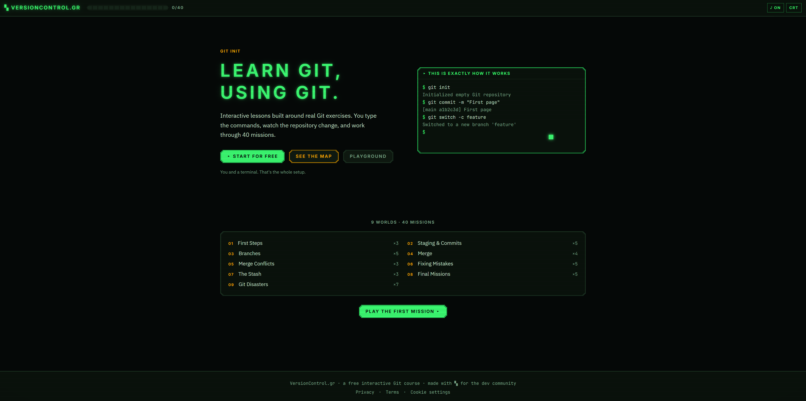
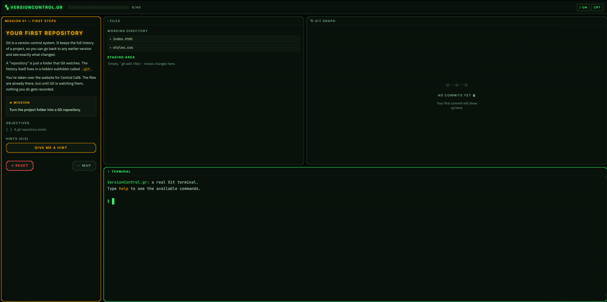
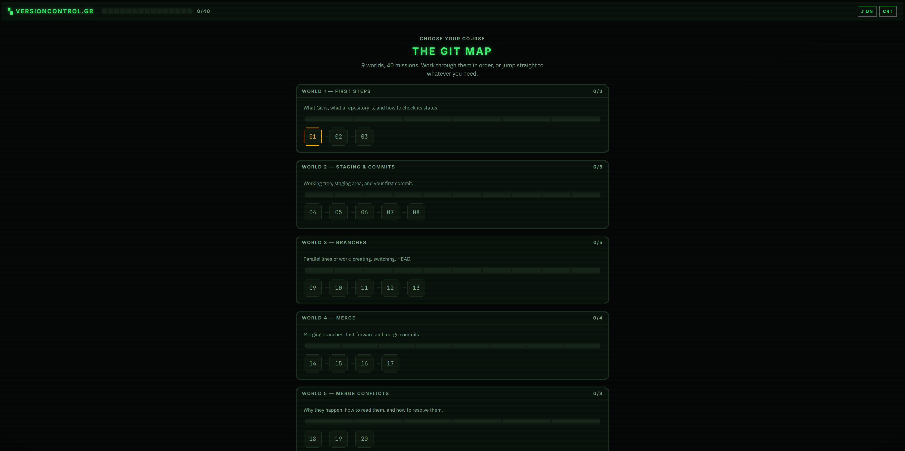

# VersionControl.gr

**Learn Git, using Git.** A free interactive Git course where a real Git engine runs
in your browser: 76 missions across 11 worlds, nothing to install.

Live at **[versioncontrol.gr](https://versioncontrol.gr)**.



## What it is

You type real Git commands into a real terminal. There is no multiple choice and no
video. Every mission sets up a small repository, you work on it, and a set of
validators checks the final state of that repository rather than the exact commands
you used. There is usually more than one way to pass.



Eleven worlds start at the terminal itself - ls, echo, folders, mv and rm - then
take you from `git init` through staging, branches, merges and conflicts,
then out to the world - fetching, pulling and pushing against a simulated remote -
before safe undo, the stash, capstone missions, and a final set of Git disasters:
recovering lost commits from the reflog, cherry-picking one commit out of a messy
branch, finding your way out of a detached HEAD.



## Running it locally

```bash
pnpm install
pnpm dev
```

| Command           | What it does                                                                   |
| ----------------- | ------------------------------------------------------------------------------ |
| `pnpm dev`        | Dev server                                                                     |
| `pnpm test`       | Engine, shell and validator tests, plus a replay of every challenge solution   |
| `pnpm build`      | Static export to `out/`                                                        |
| `pnpm smoke`      | Real-browser end-to-end run (needs `node scripts/serve-out.mjs` running first) |
| `pnpm run deploy` | Build and deploy to Cloudflare Workers                                         |

`pnpm deploy` is a reserved pnpm command, so the deploy script needs the explicit
`pnpm run`.

## How it works

The whole thing is a static Next.js export with no backend. Git itself is
[isomorphic-git](https://isomorphic-git.org) driving an in-memory
[memfs](https://github.com/streamich/memfs) volume, with the commands Git doesn't
expose as primitives (`reset`, `revert`, `restore`, `switch`, `cherry-pick`, `stash`)
implemented on top. After every command the app rebuilds one repository snapshot, and
the graph, the file panel and the validators all read from that.

The terminal is a tokenizer and command dispatcher of our own, wired to xterm.js. The
`git` commands print real Git's English output verbatim, so what you read while
learning is what you'll read at work.

Progress and settings live in your browser's local storage. Nothing is uploaded, and
there is no server that could receive it.

## Layout

```
src/git/          GitEngine: isomorphic-git on memfs, plus ops/ for the gap commands
src/terminal/     Tokenizer, command specs, shell dispatch, readline, git commands
src/validators/   Pure predicates over a repository snapshot
src/challenges/   The course content: 76 challenges in 11 sections
src/components/   UI, including the CRT arcade design system in ui/pixel.tsx
```
